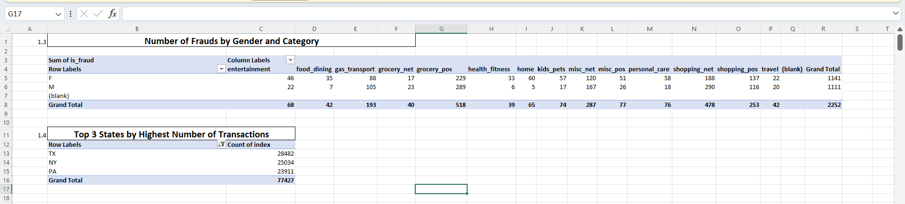
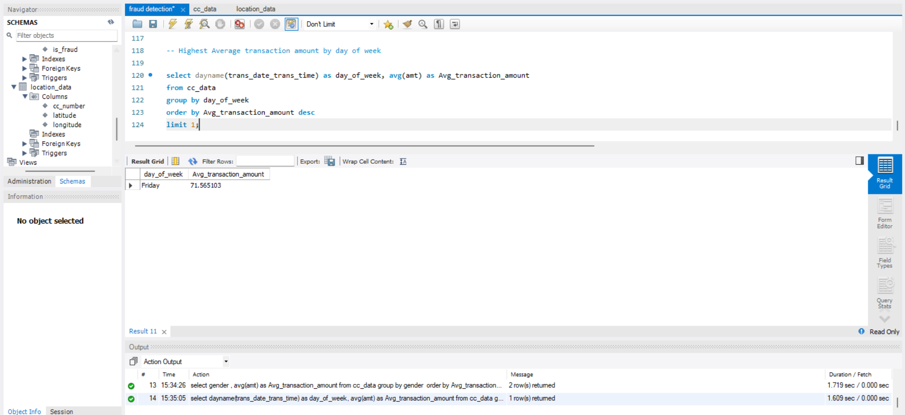
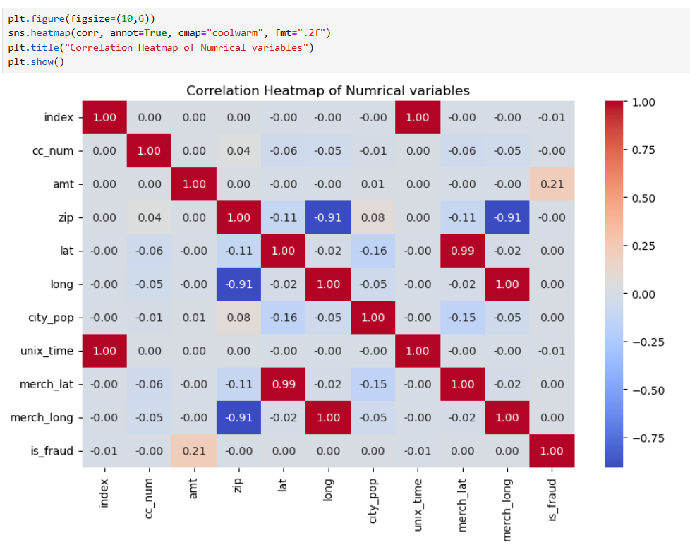
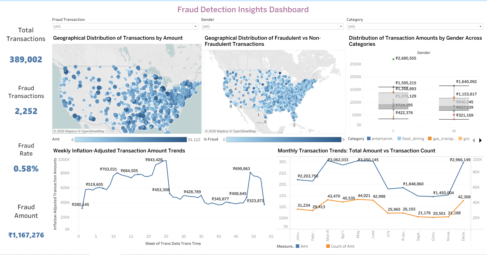

# Fraud Detection Analytics Project

## 📌 Project Overview
This project analyzes **300K+ credit card transactions** to detect fraudulent activity using **Excel, SQL, Python, and Tableau**.  
The workflow demonstrates end‑to‑end data analytics skills — from cleaning and querying to visualization and business storytelling — with actionable insights for financial institutions.

---

## 📂 Folder Structure
├── data/          # Raw and cleaned datasets ├── excel/         # Excel workbook with pivots and summaries ├── sql/           # SQL queries for fraud detection ├── python/        # Python scripts for EDA and visualization ├── tableau/       # Tableau workbook (.twb) and dashboards ├── visuals/       # Exported screenshots (Excel, SQL, Python, Tableau) ├── report/        # Final PDF report with methodology, insights, and visuals └── README.md      # Project documentation

---

## ⚙️ Methodology Summary
- **Excel** → Cleaned dataset, handled missing values, built pivot tables for fraud counts by category, merchant, and gender.  
- **SQL** → Queried fraudulent transactions (`is_fraud = 1`), summarized fraud counts by category, analyzed monthly/seasonal trends.  
- **Python** → Conducted statistical summary, anomaly detection, correlation heatmap, fraud vs non‑fraud plots, box plot analysis.  
- **Tableau** → Designed interactive dashboard with fraud hotspots map, monthly trends, and transaction amount comparisons.  

---

## 🔑 Key Insights
- Fraud clusters strongly in certain **states** (e.g., NY, TX, PA).  
- Seasonal peaks (holidays, Jan–March months) show higher fraud risk.  
- Outliers in spending behavior often linked to fraud.  
- Highest fraud count observed in **2019**, even after inflation adjustment.  

---

## 🖼️ Visuals Preview
Representative outputs from each tool are embedded below.  
Additional screenshots are available in the `visuals/` folder.

**Excel Pivot Summary**  

**SQL Query Output**  

**Python Heatmap**  

**Tableau Dashboard Overview**  

---

## 📑 Deliverables
- **Excel Workbook** → Fraud counts, pivot analysis and summary statistics  
- **SQL Scripts** → Fraud queries and trend analysis  
- **Python Notebooks** → EDA, anomaly detection, visualizations  
- **Tableau Workbook** → Interactive dashboard (`fraud_detection_dashboard.twb`)  
- **Visuals Folder** → Screenshots from all tools for quick preview  
- **Final Report** → `Fraud Detection Analytics Project Report.pdf` summarizing methodology, insights, and business impact  

---

## 💼 Business Impact
This workflow provides a fraud detection framework that helps financial institutions:
- Monitor fraud risk geographically and seasonally  
- Identify high‑risk categories and merchants  
- Support decision‑making with interactive dashboards  
- Reduce fraud losses by proactively detecting anomalies  

---

## ✅ Conclusion
By combining **Excel, SQL, Python, and Tableau**, this project demonstrates both technical depth and business storytelling.  
It showcases a scalable fraud detection solution that can be adapted to real‑world financial datasets, making it a strong portfolio piece for data analytics roles.

---

## 👤 Author
**Ayushman**

Data Analyst | Skilled in Python, SQL, Tableau, and Business Storytelling

📫 Connect with me: www.linkedin.com/in/ayushman-manav-data-analytics
